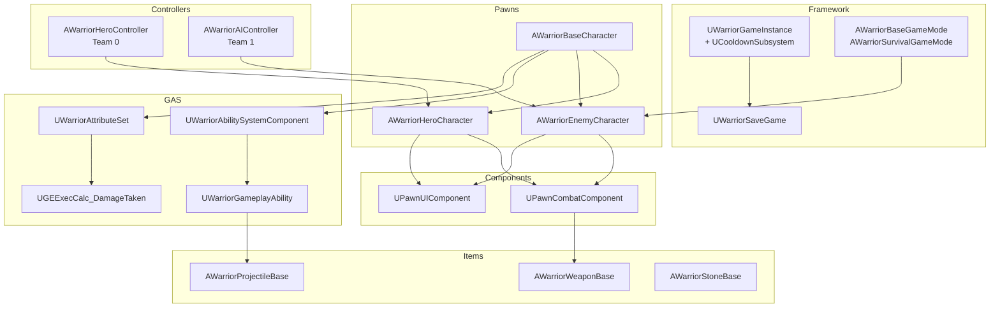
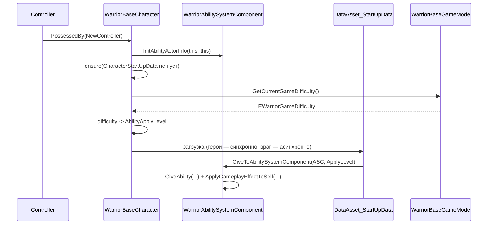

# Архитектура

## Модуль

Проект содержит один runtime-модуль `Warrior` (`Source/Warrior/Warrior.Build.cs`), исходники
разделены по классической схеме `Public/` (заголовки) и `Private/` (реализация). Папка
`Warrior/Public` добавлена в `PublicIncludePaths`, поэтому все инклюды внутри модуля пишутся от
её корня: `#include "Characters/WarriorHeroCharacter.h"`.

Зависимости модуля: `Core`, `CoreUObject`, `Engine`, `InputCore`, `EnhancedInput`, `GameplayTags`,
`GameplayTasks`, `UMG`, `AIModule`, `AnimGraphRuntime`, `MotionWarping`, `Niagara`,
`NavigationSystem`, `MoviePlayer`, `StateTreeModule`, `GameplayStateTreeModule`.

Ключевой принцип: **C++ описывает механику и точки расширения, Blueprint задаёт конкретику.**
Почти каждый базовый C++ класс имеет BP-наследника в `Content/`, где настраиваются меши, монтажи,
кривые, теги и параметры.

## Карта подсистем



## Иерархии классов

### Персонажи

`AWarriorBaseCharacter` — `Source/Warrior/Public/Characters/WarriorBaseCharacter.h`.
Наследует `ACharacter` и реализует три интерфейса: `IAbilitySystemInterface`,
`IPawnCombatInterface`, `IPawnUIInterface`. Создаёт три компонента по умолчанию:
`UWarriorAbilitySystemComponent`, `UWarriorAttributeSet`, `UMotionWarpingComponent`.
Тик выключен (`bCanEverTick = false`).

| Класс | Что добавляет |
|---|---|
| `AWarriorHeroCharacter` | `USpringArmComponent` + `UCameraComponent`, `UHeroCombatComponent`, `UHeroUIComponent`, привязку Enhanced Input |
| `AWarriorEnemyCharacter` | `UEnemyCombatComponent`, `UEnemyUIComponent`, `UWidgetComponent` (полоска здоровья), два `UBoxComponent` для хитбоксов рук, `AutoPossessAI = PlacedInWorldOrSpawned` |

Настройки движения задаются в конструкторах: герой — `MaxWalkSpeed 400`, `RotationRate 500`;
враг — `MaxWalkSpeed 300`, `RotationRate 180`, оба с `bOrientRotationToMovement = true`.
Камера героя: `TargetArmLength 200`, `TargetOffset (0, 55, 65)`.

### Компоненты пешки

Все игровые компоненты наследуют `UPawnExtensionComponentBase` — тонкую обёртку над
`UActorComponent` с шаблонными геттерами `GetOwningPawn<T>()` и `GetOwningController<T>()`
(с `static_assert` на тип).

```
UPawnExtensionComponentBase
├── UPawnCombatComponent
│   ├── UHeroCombatComponent
│   └── UEnemyCombatComponent
└── UPawnUIComponent
    ├── UHeroUIComponent
    └── UEnemyUIComponent
```

### Способности

```
UGameplayAbility (движок)
└── UWarriorGameplayAbility
    ├── UWarriorHeroGameplayAbility
    │   ├── UHeroGameplayAbility_PickUpStones
    │   └── UHeroGameplayAbility_TargetLock
    └── UWarriorEnemyGameplayAbility
```

### Предметы

```
AActor
├── AWarriorWeaponBase ──> AWarriorHeroWeapon
├── AWarriorProjectileBase
└── AWarriorPickUpBase ──> AWarriorStoneBase
```

### Anim-инстансы

```
UAnimInstance
└── UWarriorBaseAnimInstance          (DoesOwnerHaveTag, thread-safe)
    ├── UWarriorCharacterAnimInstance (GroundSpeed, bHasAcceleration, LocomotionDirection)
    │   └── UWarriorHeroAnimInstance  (bShouldEnterRelaxState после 5 c простоя)
    └── UWarriorHeroLinkedAnimInstance (слой оружия, GetHeroAnimInstance)
```

`UWarriorHeroLinkedAnimInstance` — база для **anim layer** оружия: каждое оружие в
`FWarriorHeroWeaponData` указывает свой класс слоя, который линкуется в `ABP_Hero` при экипировке
(ассеты `ALI_Hero`, `MasterAnimLayer_Hero`, `AnimLayer_HeroAxe`).

## Интерфейсы как точки доступа

Вместо кастов к конкретным классам код обращается к пешкам через два интерфейса:

| Интерфейс | Методы | Кто реализует |
|---|---|---|
| `IPawnCombatInterface` | `GetPawnCombatComponent()` (pure virtual) | `AWarriorBaseCharacter` и наследники |
| `IPawnUIInterface` | `GetPawnUIComponent()` (pure virtual), `GetHeroUIComponent()`, `GetEnemyUIComponent()` (по умолчанию `nullptr`) | то же |

Доступ к ним централизован в `UWarriorFunctionLibrary`:
`NativeGetPawnCombatComponentFromActor`, `NativeGetWarriorASCFromActor`,
`NativeDoesActorHaveTag`, `IsTargetPawnHostile` и т. д. Для каждой нативной функции есть
BP-версия с `ExpandEnumAsExecs` (`EWarriorConfirmType`, `EWarriorValidType`,
`EWarriorSuccessType`) — так в графах Blueprint вместо bool-ветвлений получаются exec-пины.

## Порядок инициализации персонажа



Различия между героем и врагом:

* **Герой** (`AWarriorHeroCharacter::PossessedBy`) грузит `CharacterStartUpData` через
  `LoadSynchronous()` — блокирующе, но гарантированно до первого кадра.
* **Враг** (`AWarriorEnemyCharacter::InitEnemyStartUpData`) грузит через
  `UAssetManager::GetStreamableManager().RequestAsyncLoad()` с лямбдой — важно для волн
  выживания, где враги спавнятся десятками.

Уровень способностей зависит от сложности **в противоположных направлениях** для героя и врага —
см. [AbilitySystem.md](AbilitySystem.md#сложность-и-уровень-способностей).

## Как компоненты общаются: gameplay-события

Прямых вызовов между подсистемами почти нет — связь идёт через **gameplay-события** GAS
(`UAbilitySystemBlueprintLibrary::SendGameplayEventToActor`) и **loose gameplay tags**.
Типичная цепочка удара:

```mermaid
sequenceDiagram
    participant Box as WeaponCollisionBox
    participant W as AWarriorWeaponBase
    participant CC as UHeroCombatComponent
    participant ASC as ASC героя
    participant GA as GA_Hero_LightAttack (BP)
    participant T as ASC цели

    Box->>W: OnComponentBeginOverlap
    W->>W: IsTargetPawnHostile?
    W->>CC: OnWeaponHitTarget (delegate)
    CC->>CC: дедупликация через OverlappedActors
    CC->>ASC: Shared.Event.MeleeHit + Player.Event.HitPause
    ASC->>GA: активация по event-тегу
    GA->>T: ApplyGameplayEffectSpecHandle (GE_Shared_DealDamage)
    GA->>T: Shared.Event.HitReact
```

Такая схема позволяет писать боевую логику в Blueprint-способностях, не трогая C++.

## Прочие утилиты

| Класс | Файл | Назначение |
|---|---|---|
| `UWarriorFunctionLibrary` | `Private/WarriorFunctionLibrary.cpp` | доступ к ASC/компонентам, теги, проверка команд, hit-react направление, валидность блока, латентный `CountDown`, переключение input mode, сохранение/загрузка сложности |
| `FWarriorCountDownAction` | `Private/WarriorTypes/WarriorCountDownAction.cpp` | `FPendingLatentAction` для таймеров в BP: выходы `Updated / Completed / Canceled` |
| `Debug::Print` | `Public/WarriorDebugHelper.h` | вывод на экран + `UE_LOG` в одну строку |
| `UCooldownSubsystem` | `Private/Subsystems/GameInstance/CooldownSubsystem.cpp` | универсальные именованные кулдауны для AI, см. [AI.md](AI.md#кулдауны-ucooldownsubsystem) |

## Перечисления общего назначения

`Source/Warrior/Public/WarriorTypes/WarriorEnumTypes.h`:

| Enum | Значения | Где используется |
|---|---|---|
| `EWarriorConfirmType` | `Yes`, `No` | BP-обёртки проверок тегов |
| `EWarriorValidType` | `Valid`, `Invalid` | BP-обёртки геттеров |
| `EWarriorSuccessType` | `Successful`, `Failed` | применение GE-спеков |
| `EWarriorCountDownActionInput` | `Start`, `Cancel` | латентный `CountDown` |
| `EWarriorCountDownActionOutput` | `Updated`, `Completed`, `Canceled` | латентный `CountDown` |
| `EWarriorGameDifficulty` | `Easy`, `Normal`, `Hard`, `VeryHard` | game mode, сохранения |
| `EWarriorInputMode` | `GameOnly`, `UIOnly` | `ToggleInputMode` для меню |
