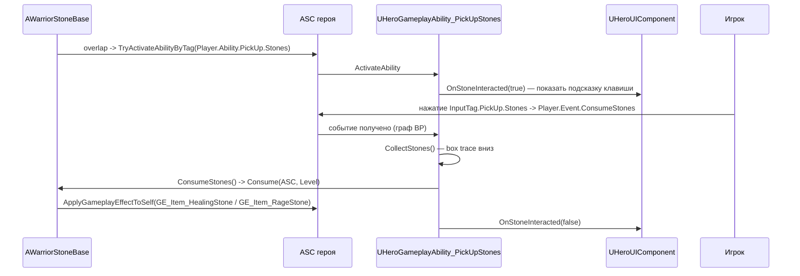

# Боевая система

## Combat-компоненты

### UPawnCombatComponent

`Source/Warrior/Public/Components/Combat/PawnCombatComponent.h`

Реестр оружия персонажа и управление хитбоксами.

| Член | Назначение |
|---|---|
| `CharacterCarriedWeaponMap` | `TMap<FGameplayTag, AWarriorWeaponBase*>` — всё носимое оружие |
| `CurrentEquippedWeaponTag` | тег экипированного оружия (`Player.Weapon.Axe`, `Enemy.Weapon`) |
| `OverlappedActors` | список уже задетых целей для дедупликации ударов |
| `RegisterSpawnedWeapon(Tag, Weapon, bAsEquipped)` | кладёт оружие в мапу и подписывается на его делегаты |
| `GetCharacterCarriedWeaponByTag(Tag)` / `GetCharacterCurrentEquippedWeapon()` | доступ к оружию |
| `ToggleWeaponCollision(bEnable, EToggleDamageType)` | включение/выключение хитбоксов |
| `OnHitTargetActor(AActor*)` / `OnWeaponPulledFromTargetActor(AActor*)` | виртуальные обработчики, переопределяются в наследниках |

```cpp
enum class EToggleDamageType : uint8 { CurrentEquipWeapon, RightHand, LeftHand };
```

* `CurrentEquipWeapon` → переключает `WeaponCollisionBox` экипированного оружия;
* `RightHand` / `LeftHand` → переключает боксы рук врага (`AWarriorEnemyCharacter`), с
  `check` на то, что владелец — именно враг.

При выключении коллизии `OverlappedActors` очищается — так один свинг наносит урон каждой цели
ровно один раз, а следующий свинг начинает с чистого списка.

`RegisterSpawnedWeapon` падает с `checkf`, если оружие с таким тегом уже зарегистрировано.

### UHeroCombatComponent

* `GetHeroCarriedWeaponByTag` / `GetHeroCurrentEquipWeapon` — типизированный доступ к `AWarriorHeroWeapon`;
* `GetHeroCurrentEquipWeaponDamageAtLevel(Level)` — `HeroWeaponData.WeaponBaseDamage` по уровню;
* `OnHitTargetActor` — дедуплицирует цель, затем посылает **себе** два события:
  `Shared.Event.MeleeHit` (с `Instigator`/`Target` в payload) и `Player.Event.HitPause`;
* `OnWeaponPulledFromTargetActor` — посылает `Player.Event.HitPause` (эффект «оружие выходит из
  цели»).

`Player.Event.HitPause` активирует `GA_Hero_HitPause`, которая через `ANS_SlowMotion` и
`CameraShake_HeroMelee` даёт кратковременный хит-стоп.

### UEnemyCombatComponent

`OnHitTargetActor` содержит проверку блока:

```cpp
bIsPlayerBlocking      = цель имеет Player.Status.Blocking
bIsMyAttackUnblockable = владелец имеет Enemy.Status.Unbloackable
если (bIsPlayerBlocking && !bIsMyAttackUnblockable)
    bIsValidBlock = UWarriorFunctionLibrary::IsValidBlock(владелец, цель)

bIsValidBlock ? SendGameplayEvent(цели, Player.Event.SuccessfulBlock)
              : SendGameplayEvent(себе,  Shared.Event.MeleeHit)
```

Так «неблокируемые» атаки (босс перед ударом получает `Enemy.Status.Unbloackable` и
`GC_Enemy_AttackWarning`) пробивают блок.

## Оружие

### AWarriorWeaponBase

`Source/Warrior/Public/Items/Weapons/WarriorWeaponBase.h`

Актор: `UStaticMeshComponent` (корень) + `UBoxComponent` (`BoxExtent 20`, коллизия по умолчанию
выключена). Два C++-делегата (не dynamic):

```cpp
DECLARE_DELEGATE_OneParam(FOnTargetInteractedDelegate, AActor*);
FOnTargetInteractedDelegate OnWeaponHitTarget;
FOnTargetInteractedDelegate OnWeaponPulledFromTarget;
```

В `OnComponentBeginOverlap` / `OnComponentEndOverlap` берётся `GetInstigator<APawn>()` (падает с
`checkf`, если инстигатор не назначен при спавне), проверяется враждебность через
`IsTargetPawnHostile` и вызывается соответствующий делегат.

### AWarriorHeroWeapon

Добавляет `FWarriorHeroWeaponData HeroWeaponData` (см.
[AbilitySystem.md](AbilitySystem.md#структуры-данных-оружия)) и хранение хендлов выданных
способностей:

```cpp
void AssignGrantedAbilitySpecHandles(const TArray<FGameplayAbilitySpecHandle>&);
TArray<FGameplayAbilitySpecHandle> GetGrantedAbilitySpecHandles() const;
```

Ассеты: `BP_HeroWeaponBase`, `BP_HeroAxe`; у врагов — `BP_Enemy_Weapon_Base`,
`BP_Guardian_Weapon`, `BP_Glacer_Weapon`.

### Управление хитбоксом из анимации

Коллизия оружия включается не кодом способности, а **anim notify state**
`ANS_ToggleWeaponCollision` на монтаже атаки: begin → `ToggleWeaponCollision(true, тип)`,
end → `ToggleWeaponCollision(false, тип)`. Второй нотифай, `AN_SendGameplayEventToOwner`,
позволяет монтажу посылать произвольные gameplay-события (например,
`Shared.Event.SpawnProjectile`, `Enemy.Event.SummonEnemies`, `Player.Event.AOE`).

## Определение команд

Команды заданы через `IGenericTeamAgentInterface` на **контроллерах**:

| Контроллер | `FGenericTeamId` |
|---|---|
| `AWarriorHeroController` | `0` |
| `AWarriorAIController` | `1` |

```cpp
bool UWarriorFunctionLibrary::IsTargetPawnHostile(APawn* QueryPawn, APawn* TargetPawn)
```

Берёт контроллеры обеих пешек, кастует к `IGenericTeamAgentInterface` и сравнивает id: разные →
враги. Если хотя бы у одной пешки нет контроллера с интерфейсом — возвращает `false`
(не враждебны). Это значит, что **пешка без контроллера не может быть повреждена**.

## Блок и парирование

```cpp
bool UWarriorFunctionLibrary::IsValidBlock(AActor* InAttacker, AActor* InDefender)
{
    return FVector::DotProduct(InAttacker->GetActorForwardVector(),
                               InDefender->GetActorForwardVector()) < -0.1f;
}
```

Блок валиден, если персонажи смотрят примерно друг на друга (угол > ~96°). Тег состояния —
`Player.Status.Blocking`, вешается BP-способностью `GA_Hero_Block`, привязанной к
`InputTag.MustBeHeld.Block` — то есть блок держится, пока зажата клавиша (отпускание отменяет
способность через `OnAbilityInputReleased`).

Успешный блок → цели прилетает `Player.Event.SuccessfulBlock`, что запускает эффекты
`GC_Hero_SuccessfulBlock` / `GC_Hero_PerfectBlock` / `GC_Hero_MagicShield`.

## Направление hit react

```cpp
FGameplayTag UWarriorFunctionLibrary::ComputeHitReactDirectionTag(
    AActor* InAttacker, AActor* InVictim, float& OutAngleDifference);
```

Считает угол между forward-вектором жертвы и направлением на атакующего, знак берётся из
`CrossResult.Z`:

| Угол | Тег |
|---|---|
| `[-45, 45]` | `Shared.Status.HitReact.Front` |
| `[-135, -45)` | `Shared.Status.HitReact.Left` |
| `< -135` или `> 135` | `Shared.Status.HitReact.Back` |
| `(45, 135]` | `Shared.Status.HitReact.Right` |

Тег выбирает монтаж в `GA_Hero_HitReact` / `GA_*_HitReact_Base`
(`AM_Hero_HitReact_Front/Back/Left/Right`).

## Снаряды

`Source/Warrior/Public/Items/WarriorProjectileBase.h`

Состав: `UBoxComponent` (корень, `QueryOnly`, блокирует `Pawn`, `WorldStatic`, `WorldDynamic`) +
`UNiagaraComponent` + `UProjectileMovementComponent` (`InitialSpeed 700`, `MaxSpeed 900`,
`ProjectileGravityScale 0`), `InitialLifeSpan = 4 с`.

```cpp
enum class EProjectileDamagePolicy : uint8 { OnHit, OnBeginOverlap };
```

* **`OnHit`** — снаряд-«пуля»: при попадании вызывается BP-хук `BP_OnSpawnHitFX(HitLocation)`,
  проверяется враждебность (если цель не враг — просто `Destroy()`), затем проверка блока
  (`Player.Status.Blocking` + `IsValidBlock`) и либо `Player.Event.SuccessfulBlock` цели, либо
  урон; после — `Destroy()`.
* **`OnBeginOverlap`** — снаряд-«область»: в `BeginPlay` канал `ECC_Pawn` переключается на
  `ECR_Overlap`, урон наносится всем враждебным пешкам по одному разу (дедупликация через
  `OverlapActors`), снаряд **не** уничтожается и живёт до истечения `InitialLifeSpan`.

Урон передаётся снаружи: `DamageEffectSpecHandle` помечен `ExposeOnSpawn`, поэтому способность
собирает спек (`MakeEnemyDamageEffectSpecHandle`) и передаёт его в `SpawnActor`. `HandleApplyDamage`
падает с `checkf`, если спек не назначен.

Ассеты: `BP_Projectile_Base`, `BP_Projectile_Hero_Slash`, `BP_Projectile_Glacer`.

## Подбираемые предметы и камни

### AWarriorPickUpBase

`USphereComponent` (корень, радиус 50) с подпиской на begin overlap; сам обработчик пустой —
это точка расширения.

### AWarriorStoneBase

```cpp
void Consume(UWarriorAbilitySystemComponent* ASC, int32 ApplyLevel);
```

Применяет `StoneGameplayEffectClass` к ASC героя с уровнем способности и вызывает BP-хук
`BP_OnStoneConsumed` (уничтожение актора / VFX делаются в Blueprint).

`OnPickUpCollisionSphereBeginOverlap` при входе героя вызывает
`TryActivateAbilityByTag(Player.Ability.PickUp.Stones)`.

Полный цикл подбора:



Ассеты: `BP_StoneBase`, `BP_HealingStone`, `BP_RageStone`, эффекты `GE_Item_HealingStone`,
`GE_Item_RageStone`, статы `CT_StoneStats`. Камни также спавнятся врагами
(`GA_Enemy_SpawnStone_Base`, `Enemy.Ability.SpawnStone`) — это источник восстановления в режиме
выживания.

## Таргет-лок

`UHeroGameplayAbility_TargetLock` — `Source/Warrior/Private/AbilitySystem/Abilities/HeroGameplayAbility_TargetLock.cpp`

Способность привязана к `InputTag.Toggleable.TargetLock`, поэтому повторное нажатие её отменяет.

**Активация** (`ActivateAbility`): `TryLockOnTarget()` → `InitTargetLockMovement()` →
`InitTargetLockMappingContext()`.

| Этап | Что происходит |
|---|---|
| `GetAvailableActorsToLock()` | `BoxTraceMultiForObjects` вперёд на `BoxTraceDistance = 5000` с боксом `TraceBoxSize = (5000, 5000, 300)`, каналы из `BoxTraceChannel`; сам герой исключается |
| `GetNearestTargetFromAvailableActors()` | `UGameplayStatics::FindNearestActor` |
| `DrawTargetLockWidget()` | создаёт виджет `TargetLockWidgetClass` (`WBP_TargetLockIndicator`) и добавляет во вьюпорт |
| `InitTargetLockMovement()` | кэширует `MaxWalkSpeed` и ставит `TargetLockMaxWalkSpeed = 150` |
| `InitTargetLockMappingContext()` | добавляет `TargetLockMappingContext` (`IMC_TargetLock`) с приоритетом **3** |

**Каждый тик** (`OnTargetLockTick`, вызывается из `UAbilityTask_ExecuteTaskOnTick`):

1. Если цель пропала, цель мертва (`Shared.Status.Death`) или мёртв сам герой — способность
   отменяется.
2. `SetTargetLockWidgetPosition()` — проецирует мировую позицию цели в координаты вьюпорта; размер
   виджета определяется один раз обходом `WidgetTree` в поисках `USizeBox` и вычитается
   пополам для центрирования.
3. Поворот перехватывается, **только если** герой не в состоянии `Player.Status.Rolling` и не
   `Player.Status.Blocking`: `FindLookAtRotation` минус `TargetLockCameraOffsetDistance = 20` по
   питчу, интерполяция `RInterpTo` со скоростью `TargetLockRotationInterpSpeed = 5`, результат
   ставится и в `SetControlRotation`, и в `SetActorRotation` (только yaw).

**Переключение цели** (`SwitchTarget(тег направления)`): пересобирает список цели, делит его на
левые/правые по знаку `CrossProduct(на текущую цель, на кандидата).Z` и берёт ближайшего с нужной
стороны. Направление приходит из ввода: `AWarriorHeroCharacter::Input_SwitchTargetTriggered`
запоминает вектор оси, `Input_SwitchTargetCompleted` посылает
`Player.Event.SwitchTarget.Left/Right` в зависимости от знака `X`.

**Завершение** (`EndAbility`): `ResetTargetLockMappingContext()` → `ResetTargetLockMovement()`
(восстанавливает скорость) → `CleanUp()` (чистит списки, удаляет виджет, сбрасывает кэш).

## Хитбоксы рук врага

`AWarriorEnemyCharacter` создаёт `LeftHandCollisionBox` и `RightHandCollisionBox`, прикреплённые к
мешу, с выключенной коллизией и общим обработчиком `OnBodyCollisionBoxBeginOverlap` → при
враждебной пешке вызывает `EnemyCombatComponent->OnHitTargetActor(HitPawn)`.

Кость прикрепления настраивается свойствами `LeftHandCollisionBoxAttachBoneName` /
`RightHandCollisionBoxAttachBoneName`; в редакторе `PostEditChangeProperty` немедленно
переприкрепляет боксы при изменении имени кости (удобно настраивать «на глаз»).

Так реализованы удары без оружия — монтаж включает нужный бокс через
`ANS_ToggleWeaponCollision` с типом `LeftHand` / `RightHand`.

## Motion Warping

`UMotionWarpingComponent` есть на каждом `AWarriorBaseCharacter`. Цель варпа для врага обновляет
BP-сервис `BTService_UpdateMotionWarpAttackTarget` — атака «дотягивается» до игрока, не проваливаясь
в пустоту.
