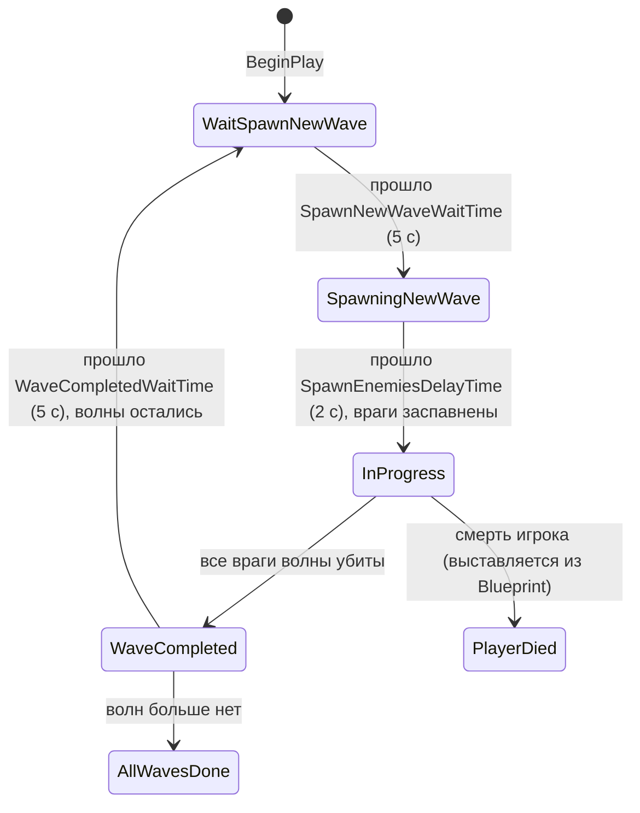

# Игровой цикл

## Game modes

### AWarriorBaseGameMode

`Source/Warrior/Public/GameModes/WarriorBaseGameMode.h`

Минимальный `AGameModeBase` с включённым тиком и единственным свойством:

```cpp
UPROPERTY(EditDefaultsOnly, BlueprintReadOnly, Category="Game Settings")
EWarriorGameDifficulty CurrentGameDifficulty;

FORCEINLINE EWarriorGameDifficulty GetCurrentGameDifficulty() const;
```

Это источник истины по сложности: персонажи опрашивают его в `PossessedBy` и переводят сложность в
уровень способностей (см.
[AbilitySystem.md](AbilitySystem.md#сложность-и-уровень-способностей)).

Ассеты: `BP_BaseGameMode` (глобальный game mode по умолчанию), `BP_MainMenuGameMode`.

### AWarriorSurvivalGameMode

`Source/Warrior/Private/GameModes/WarriorSurvivalGameMode.cpp` — волновой режим.

#### Состояния

```cpp
enum class EWarriorSurvivalGameModeState : uint8 {
    WaitSpawnNewWave, SpawningNewWave, InProgress, WaveCompleted, AllWavesDone, PlayerDied
};
```

Смена состояния всегда через `SetCurrentSurvivalGameModeState`, который бродкастит
`OnSurvivalGameModeStateChanged` — на него подписаны виджеты
(`WBP_WaitTextWithCountDown`, `WBP_WaitTextNoCountDown`, `WBP_WinScreen`, `WBP_LoseScreen`).



Состояние `PlayerDied` в C++ не выставляется — им управляет Blueprint (`BP_SurvivalGameMode`).

#### Тайминги

| Свойство | По умолчанию |
|---|---|
| `SpawnNewWaveWaitTime` | `5.0` |
| `SpawnEnemiesDelayTime` | `2.0` |
| `WaveCompletedWaitTime` | `5.0` |

Отсчёт ведётся в `Tick` через накопитель `TimePastSinceStart`.

#### Описание волн

Волны описываются в data table `DT_EnemyWaveSpawner` со строкой типа:

```cpp
struct FWarriorEnemyWaveSpawnerInfo {
    TSoftClassPtr<AWarriorEnemyCharacter> SoftEnemyClassToSpawn;
    int32 MinPerSpawnCount = 1;
    int32 MaxPerSpawnCount = 3;
};

struct FWarriorEnemyWaveSpawnerTableRow : FTableRowBase {
    TArray<FWarriorEnemyWaveSpawnerInfo> EnemyWaveSpawnerDefinitions;
    int32 TotalEnemyToSpawnThisWave = 1;
};
```

> **Имена строк обязаны быть `Wave1`, `Wave2`, …** — `GetCurrentWaveSpawnerTableRow()` собирает имя
> как `"Wave" + FString::FromInt(CurrentWaveCount)` и падает с `checkf`, если строки нет.
> Количество волн определяется числом строк в таблице (`GetRowNames().Num()`).

#### Спавн

`PreLoadNextWaveEnemies()` асинхронно грузит классы врагов следующей волны в
`PreLoadedEnemyClassMap` — благодаря этому сам спавн не вызывает хитчей.

`TrySpawnWaveEnemies()`:

1. При первом вызове собирает все `ATargetPoint` уровня (`GetAllActorsOfClass`); падает с `checkf`,
   если точек нет.
2. Для каждой записи волны берёт случайное количество из `[MinPerSpawnCount, MaxPerSpawnCount]`.
3. Класс достаёт из `PreLoadedEnemyClassMap` через `FindChecked`.
4. Выбирает случайный target point, ищет случайную точку на навмеше в радиусе `400`
   (`K2_GetRandomLocationInNavigableRadius`), поднимает её на `+150` по Z.
5. Спавнит с `AdjustIfPossibleButAlwaysSpawn`, подписывается на `OnDestroyed`, увеличивает
   счётчики.
6. Прерывается, как только `TotalSpawnedEnemiesThisWaveCounter` достигает
   `TotalEnemyToSpawnThisWave`.

#### Учёт убитых

```cpp
void OnEnemyDestroyed(AActor* DestroyedActor)
```

Уменьшает `CurrentSpawnedEnemiesCounter`; если в волне остались нерождённые враги — доспавнивает
(поэтому на карте одновременно живёт ограниченное число врагов при большой волне); если счётчик
дошёл до нуля — сбрасывает счётчики и переводит режим в `WaveCompleted`.

`RegisterSpawnedEnemies(TArray<AWarriorEnemyCharacter*>)` — публичный BP-метод для врагов,
появившихся **не** из волны (призыв боссом через `UAbilityTask_WaitSpawnEnemies`): подписывает их
на `OnDestroyed` и учитывает в счётчике, чтобы волна не завершилась раньше времени.

#### Сложность при старте матча

```cpp
void InitGame(const FString& MapName, const FString& Options, FString& ErrorMessage)
{
    Super::InitGame(...);
    EWarriorGameDifficulty Saved;
    if (UWarriorFunctionLibrary::TryLoadSavedGameDifficulty(Saved))
        CurrentGameDifficulty = Saved;
}
```

Сложность, выбранная в меню опций, подхватывается до создания игрока — то есть уровни способностей
уже рассчитаны верно.

## Сохранения

`UWarriorSaveGame` — `Source/Warrior/Public/SaveGame/WarriorSaveGame.h`

```cpp
UPROPERTY(BlueprintReadOnly)
EWarriorGameDifficulty SavedCurrentGameDifficulty;
```

Работа через две функции библиотеки:

| Функция | Что делает |
|---|---|
| `SaveCurrentGameDifficulty(EWarriorGameDifficulty)` | создаёт новый объект сохранения и пишет в слот |
| `TryLoadSavedGameDifficulty(EWarriorGameDifficulty&)` | проверяет наличие слота, читает значение |

Имя слота — строковое представление тега `GameData.SaveGame.Slot.1`, user index `0`.
Сохранение всегда создаёт объект заново (`CreateSaveGameObject`), поэтому при добавлении новых
полей их нужно заполнять в том же вызове, иначе они затрутся значениями по умолчанию.

## Game instance и уровни

`UWarriorGameInstance` — `Source/Warrior/Private/WarriorGameInstance.cpp`

### Реестр уровней по тегам

```cpp
struct FWarriorGameLevelSet {
    FGameplayTag LevelTag;              // meta = (Categories = "GameData.Level")
    TSoftObjectPtr<UWorld> Level;
    bool IsValid() const;
};

TArray<FWarriorGameLevelSet> GameLevelSets;
TSoftObjectPtr<UWorld> GetGameLevelByTag(FGameplayTag InTag) const;
```

Меню не хранит путей к картам — оно запрашивает уровень по тегу `GameData.Level.MainMenuMap` или
`GameData.Level.SurvivalGameModeMap`. Соответствие настраивается в `BP_WarriorGameInstance`.
При отсутствии совпадения возвращается пустой `TSoftObjectPtr`.

### Экран загрузки

```cpp
void Init() {
    FCoreUObjectDelegates::PreLoadMap.AddUObject(this, &ThisClass::OnPreLoadMap);
    FCoreUObjectDelegates::PostLoadMapWithWorld.AddUObject(this, &ThisClass::OnDestinationWorldLoaded);
}
```

`OnPreLoadMap` настраивает `FLoadingScreenAttributes` (авто-закрытие по завершении загрузки,
минимум 2 секунды показа) и отдаёт их `GetMoviePlayer()`; `OnDestinationWorldLoaded` останавливает
показ.

> Используется `FLoadingScreenAttributes::NewTestLoadingScreenWidget()` — **тестовый** виджет
> движка, заглушка вместо собственного экрана загрузки.

## Таймеры в UI: латентный CountDown

```cpp
UFUNCTION(BlueprintCallable, meta=(Latent, WorldContext="WorldContextObject",
          LatentInfo="LatentInfo", ExpandEnumAsExecs="CountDownInput|CountDownOutput",
          TotalTime="1.0", UpdateInterval="0.1"))
static void CountDown(const UObject* WorldContextObject, float TotalTime, float UpdateInterval,
                      float& OutRemainingTime, EWarriorCountDownActionInput CountDownInput,
                      EWarriorCountDownActionOutput& CountDownOutput, FLatentActionInfo LatentInfo);
```

Реализация — `FWarriorCountDownAction : FPendingLatentAction`
(`Source/Warrior/Private/WarriorTypes/WarriorCountDownAction.cpp`).

* Вход `Start` создаёт действие, если такого ещё нет; `Cancel` помечает его на отмену.
* Выходы: `Updated` (раз в `UpdateInterval`, с обновлённым `OutRemainingTime`), `Completed`,
  `Canceled`.

Применяется в виджетах ожидания волны (`WBP_WaitTextWithCountDown`).

## Конфигурация по умолчанию

`Config/DefaultEngine.ini`:

```ini
[/Script/EngineSettings.GameMapsSettings]
GameDefaultMap=/Game/Maps/CombatTestMap.CombatTestMap
EditorStartupMap=/Game/Maps/CombatTestMap.CombatTestMap
GlobalDefaultGameMode=/Game/GameModes/BP_BaseGameMode.BP_BaseGameMode_C
GameInstanceClass=/Game/Generic/BP_WarriorGameInstance.BP_WarriorGameInstance_C
```

Рендер: статическое освещение выключено, Lumen и ray-traced reflections выключены
(`r.DynamicGlobalIlluminationMethod=0`, `r.ReflectionMethod=0`), virtual shadow maps выключены,
mesh distance fields включены.

### CoreRedirects

В `[CoreRedirects]` накоплены переименования — их нужно сохранять, иначе старые ассеты сломаются:

| Было | Стало |
|---|---|
| `DataAsset_РукщStartUpData` (битая кодировка) | `DataAsset_HeroStartUpData` |
| `PawnExtentionComponentBase` | `PawnExtensionComponentBase` |
| `HeroGameplayAbility_TargetLock.SeitchTarget` | `...SwitchTarget` |
| `AWarriorPickUpBase` | `WarriorPickUpBase` |
| `WarriorSurvialGameMode` | `WarriorSurvivalGameMode` |
| `CooldownManagerSubsystem` | `CooldownSubsystem` |
