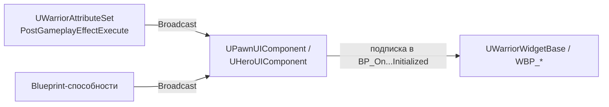

# UI

UI построен на «мосте» из двух частей: **UI-компоненты** на пешке публикуют делегаты, а
**виджеты** на них подписываются. Виджет никогда не опрашивает атрибуты напрямую и не знает о
классе персонажа.



## UI-компоненты

### UPawnUIComponent

`Source/Warrior/Public/Components/UI/PawnUIComponent.h`

```cpp
DECLARE_DYNAMIC_MULTICAST_DELEGATE_OneParam(FOnPercentChangedDelegate, float, NewPercent);

UPROPERTY(BlueprintAssignable)
FOnPercentChangedDelegate OnCurrentHealthChanged;   // доля Current/Max
```

### UHeroUIComponent

Добавляет делегаты, специфичные для игрока:

| Делегат | Параметры | Кто бродкастит |
|---|---|---|
| `OnCurrentRageChanged` | `float NewPercent` | `UWarriorAttributeSet::PostGameplayEffectExecute` |
| `OnEquippedWeaponChanged` | `TSoftObjectPtr<UTexture2D> SoftWeaponIcon` | BP-способности экипировки |
| `OnAbilityIconSlotUpdated` | `FGameplayTag AbilityInputTag`, `TSoftObjectPtr<UMaterialInterface> SoftAbilityIconMaterial` | BP-способности экипировки (из `FWarriorHeroSpecialAbilitySet`) |
| `OnAbilityCooldownBegin` | `FGameplayTag AbilityInputTag`, `float TotalCooldownTime`, `float RemainingCooldownTime` | BP-способности спец-атак |
| `OnStoneInteracted` | `bool bShouldDisplayIconInputKey` | `UHeroGameplayAbility_PickUpStones` |

Иконки передаются как `TSoftObjectPtr` — виджет грузит их асинхронно сам.

### UEnemyUIComponent

Реестр виджетов, созданных для конкретного врага (полоска здоровья, полоска босса):

```cpp
void RegisterEnemyDrawnWidget(UWarriorWidgetBase* InWidgetToRegister);
void RemoveEnemyDrawnWidgetIfAny();   // RemoveFromParent для всех и очистка списка
```

Нужен для сценария «босс умер → убрать его полоску из HUD»: способность
`GA_Enemy_DrawBossBar_Base` регистрирует виджет, способность смерти вызывает удаление.

## UWarriorWidgetBase

`Source/Warrior/Public/Widgets/WarriorWidgetBase.h` — база всех `WBP_*`.

| Метод | Тип | Когда вызывается |
|---|---|---|
| `NativeOnInitialized()` | override | при инициализации: кастует `GetOwningPlayerPawn()` к `IPawnUIInterface`, и если есть `UHeroUIComponent` — вызывает BP-событие |
| `BP_OnOwningHeroUIComponentInitialized(UHeroUIComponent*)` | `BlueprintImplementableEvent` | точка подписки на делегаты героя |
| `InitEnemyCreatedWidget(AActor* OwningEnemyActor)` | `BlueprintCallable` | вызывается вручную для виджетов врага |
| `BP_OnOwningEnemyUIComponentInitialized(UEnemyUIComponent*)` | `BlueprintImplementableEvent` | точка подписки на делегаты врага |

`InitEnemyCreatedWidget` падает с `checkf`, если у актора нет `UEnemyUIComponent` — то есть
передавать в него можно только врагов.

Типовой Blueprint-граф виджета: событие `On Owning Hero UI Component Initialized` → `Bind Event to
OnCurrentHealthChanged` → обновление прогресс-бара.

## Полоска здоровья врага

`AWarriorEnemyCharacter` создаёт `UWidgetComponent EnemyHealthWidgetComponent`, прикреплённый к
мешу. В `BeginPlay`:

```cpp
if (UWarriorWidgetBase* HealthWidget = Cast<UWarriorWidgetBase>(EnemyHealthWidgetComponent->GetUserWidgetObject()))
    HealthWidget->InitEnemyCreatedWidget(this);
```

Класс виджета задаётся в Blueprint врага (`WBP_DefaultEnemyHealthBar`).

## Виджет таргет-лока

`UHeroGameplayAbility_TargetLock` создаёт `TargetLockWidgetClass`
(`WBP_TargetLockIndicator`) и позиционирует его каждый тик. Размер виджета определяется поиском
`USizeBox` в `WidgetTree` — **поэтому корневой размер индикатора должен задаваться именно через
`Size Box` с явными `Width Override` / `Height Override`**, иначе центрирование не сработает.

## Ассеты виджетов

`Content/Widgets/`

| Папка | Ассеты |
|---|---|
| `HeroWidgets` | `WBP_HeroOverlay` (основной HUD), `WBP_TargetLockIndicator` |
| `EnemyWidgets` | `WBP_DefaultEnemyHealthBar`, `WBP_DefaultBossHealthBar` |
| `GameModeWidgets` | `WBP_MainMenu`, `WBP_OptionsMenu`, `WBP_PauseScreen`, `WBP_WinScreen`, `WBP_LoseScreen`, `WBP_WaitTextWithCountDown`, `WBP_WaitTextNoCountDown` |
| `TemplateWidgets` | `TP_WBP_StatusBar`, `TP_WBP_IconSlot`, `TP_WBP_AbilityIconSlot`, `TP_WBP_InputKeySlot`, `TP_WBP_MainMenuButton`, `TP_WBP_PauseScreenButton`, стилевые `WarriorButton`, `WarriorTextBlock`, `WarriorSizeBox` |

`TP_WBP_*` — переиспользуемые шаблоны, из которых собираются экраны; `Warrior*` — предустановленные
стили элементов.

## Меню и режим ввода

Экраны меню переключают режим ввода через
`UWarriorFunctionLibrary::ToggleInputMode(EWarriorInputMode::UIOnly / GameOnly)` — см.
[Input.md](Input.md#переключение-режима-ввода-для-ui). Выбор сложности в `WBP_OptionsMenu`
сохраняется через `SaveCurrentGameDifficulty`, переход между уровнями — через
`UWarriorGameInstance::GetGameLevelByTag`.

Экраны состояния режима выживания подписываются на
`AWarriorSurvivalGameMode::OnSurvivalGameModeStateChanged`, а обратный отсчёт до волны рисуют через
латентную ноду `CountDown` (см. [GameFlow.md](GameFlow.md#таймеры-в-ui-латентный-countdown)).

## Настройки UI

`Config/DefaultEngine.ini`:

```ini
[/Script/Engine.UserInterfaceSettings]
bAuthorizeAutomaticWidgetVariableCreation=False
FontDPIPreset=Standard
FontDPI=72
```

Автосоздание переменных для виджетов отключено — переменная появляется только если поставить
галочку `Is Variable` вручную.
